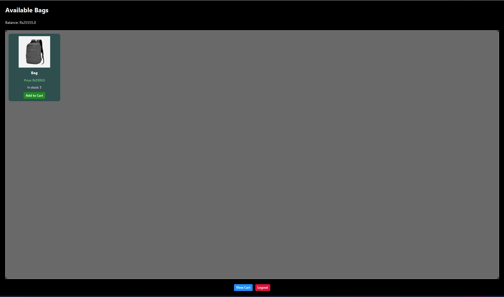

# 👜 Bag Store System



A desktop-based e-commerce and inventory management system developed using **JavaFX** and **Object-Oriented Programming (OOP)** principles in Java.

The application allows users to browse and purchase bags while providing administrators with full inventory management features.

---

# 🚀 Features

## 👤 User Features

### 🔐 User Registration & Login

Users can create accounts using:
- Name
- Email
- Password
- Initial Balance

User data is stored permanently using file handling (`users.txt`).

Login authentication validates credentials before allowing access.

---

### 🛍️ Product Catalog

Displays all available bags in a professional card-based UI.

Each product includes:
- Bag Image
- Product Name
- Price
- Stock Quantity

---

### 🛒 Shopping Cart

Users can:
- Add products to cart
- View selected items
- Checkout products

---

### 💳 Checkout System

- Calculates total cart amount automatically.
- Deducts user balance after successful purchase.
- Updates stock quantity in real-time.

Prevents purchases if:
- Stock is unavailable
- User balance is insufficient

---

# ⚙️ Admin Features

## 🔑 Admin Login

Separate secure admin login panel.

---

## 📦 Product Management

Admins can:
- Add new bags
- Edit existing products
- Delete products
- Select Image

Changes instantly appear in the Product UI.

---

## 📊 Stock Management

- Tracks available stock for every product.
- Prevents invalid purchases.
- Automatically updates stock after checkout.

---

## 🖼️ Product Image System

- Dynamically loads product images.
- Product images are mapped using product IDs.

Example:

```text
B001.jpg
B002.jpg
```

---

# 🛠️ Technologies Used

- Java
- JavaFX
- Object-Oriented Programming (OOP)
- File Handling
- Java Collections
- GUI Event Handling

---

# 📁 Project Structure

```text
hellofx/
│
├── src/
│   ├── APPP/
│   │   ├── LoginUI.java
│   │   ├── RegisterUI.java
│   │   ├── AdminLoginUI.java
│   │   ├── AdminBagUI.java
│   │   ├── ProductUI.java
│   │   ├── CartUI.java
│   │   ├── CheckoutUI.java
│   │   ├── Product.java
│   │   ├── User.java
│   │   ├── UserManager.java
│   │   ├── StockManager.java
│   │   ├── CartManager.java
│   │   └── Other Classes...
│   │
│   ├── B001.jpg
│   ├── B002.jpg
│   └── bag_store.jpg
│
├── products.txt
├── users.txt
├── votes.txt
├── README.md
└── .gitignore
```

---

# ▶️ How to Run the Project

## ✅ Requirements

- JDK 21 or above
- JavaFX SDK

---

# ⚙️ VM Arguments

Add the following VM arguments in Eclipse:

```bash
--module-path "PATH_TO_JAVAFX_LIB" --add-modules javafx.controls,javafx.fxml
```


# 🧠 Main Entry Point

Run:

```text
LoginUI.java
```

This is the main launcher class of the application.

---

# 🔑 Admin Credentials

For Admin Use:

```text
Username: admin
Password: admin123
```

---

# 💾 Data Storage

The system uses text files for persistent data storage.

| File | Purpose |
|------|----------|
| users.txt | Stores user account information |
| products.txt | Stores product inventory |

---

# 🎨 UI Design

The project uses:
- Modern JavaFX dark-themed interfaces
- Rounded buttons and text fields
- Card-based product layouts
- Professional desktop application styling

---

# 📚 OOP Concepts Used

- Classes & Objects
- Encapsulation
- Constructors
- ArrayLists
- File Handling
- Method Overriding
- GUI Event Handling

---

# 📄 License

This project is created for educational purposes only.
